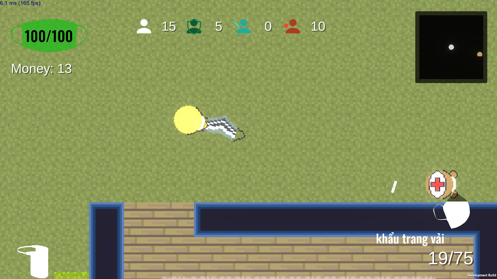

  

 

  <strong>A Game I made when we were in Corona Lockdown</strong>

In Game Corona, you are a doctor who tries to prevent the corona breakout, you have multiple options to achieve it either by using sanitizers, providing masks for everyone, wearing a protection shield, or using soaps,... Each offers a unique way to stop the virus such as searching for who is sick, who doesn't wear a mask, who is contagious. You can only win by safely containing and securing the virus

**Do you have what it takes to become a doctor? Prove yourself worthy in this game**

## Play

Go to the release section and test my game! Good luck in your journey, doctor!

## Documentation

Sadly this is a small game, there are no documents for this...

## Preview
**Gameplay**

**menus**

## Contributing

We welcome contributions to the Game Corona! These are the many ways you can help:

- Submit patches and features
- Recommendation to this game by emailing me at htglvl@gmail.com
- Report bugs
